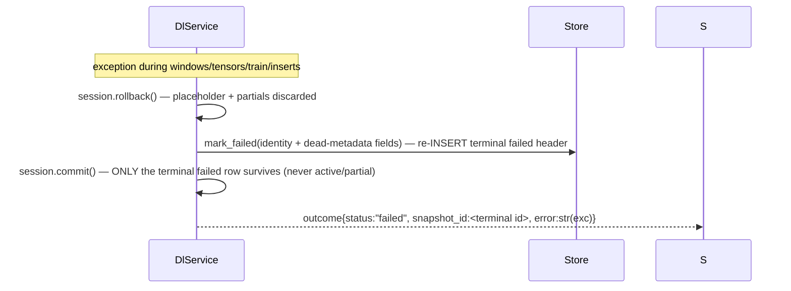

# Design: DL Snapshot Persistence (`dl-snapshot-persistence`)

## Technical Approach

Replicate the proven ML persistence pipeline (flush-only store + atomic-tx service + thin CLI/API surfaces), extended with the DL-specific pieces: per-model weight BLOBs (DLE-09), real-`cut` fingerprint threading (DLE-05/08), and delete-based retirement of the superseded active's weights (DLE-12). No schema change; INSERT-only writer against `0010_dl_tables` (head `0016`). Implements existing requirements verbatim — zero spec deltas (see change specs).

## Ratified Resolutions (design-routed)

| # | Resolution | Choice | Alternatives rejected | Rationale |
|---|---|---|---|---|
| R1 | Old-active weights on retire | DELETE the old active's `dl_weights` rows **inside the same tx**, folded into `retire_old_active(keep_id)` | Mark rows (needs new status column = schema change, a stated non-goal); leave orphaned (spec says "(and its weights rows)" are retired too; orphans remain decodable/ambiguous) | Literal DLE-12 outcome; header rows stay immutable/auditable; keeps change INSERT/DELETE-only |
| R2 | Omitted-cut default | `real_cut = len(frame)*4//5` walk-forward boundary (M-A8 parity, `ml/engine.py:159`); explicit `--cut`/query `cut` overrides | Require `cut` (contradicts REQ-10 "optional"); keep `0` (violates DLE-08 acceptance "changing cut changes the fingerprint") | REQ-10 optionality + DLE-05 declare-per-run both hold once the service declares the resolved value into the fingerprint |

## Architecture Decisions

**ADR-1 — Store is flush-only; caller owns commit.** Mirrors `MlSnapshotStore` (`ml/snapshot_store.py:23-141`). The single-commit discipline is what guarantees exactly-one-active per `(lottery_id, model_set)` — `meta/context.py`, `meta_service`, and `exp_service` all assume it mid-flight. Alternative (store commits internally) opens two-active windows on partial failure.

**ADR-2 — Delete-not-mark weight retirement.** See R1; deletion happens inside `retire_old_active` so callers cannot forget the weight half of DLE-12.

**ADR-3 — Real `cut` participates in the fingerprint.** Conformance fix restoring DLE-08 acceptance; `dl_*` tables are empty today (no writer ever existed), so the digest change breaks nothing persisted and needs no migration/backfill.

**ADR-4 — Adapters duplicated per surface.** House convention: CLI owns `_CliDrawAdapter/_CliFeatureAdapter`, API owns its own `_DrawAdapter/_FeatureAdapter` (already duplicated for ML). Sharing would couple surfaces across engines; each composition root converts ML carriers to DL carriers at the seam (DLE-13): `ml.providers.DrawRow → dl.providers.DrawRow`, `ml.feature_reader.FeatureValueRow → dl.providers.FeatureRow` (field-for-field).

## Engine Cut Threading (`backend/src/backend/app/dl/engine.py`)

```python
def train(family, train_batch, eval_batch, *, epochs=DEFAULT_EPOCHS,
          batch_size=DEFAULT_BATCH_SIZE, lr=DEFAULT_LR, seed=DL_SEED,
          cut: int, fingerprint: str | None = None) -> TrainResult   # cut REQUIRED kw-only
```
- Replace hardcoded `cut=0` (:236) with the declared `cut`; add `cut: int` to `TrainResult`.
- Optional `fingerprint` injection: a model-set run shares ONE run fingerprint across header + both weight blobs (proposal: `weights_fingerprint`=run fp); `None` keeps the current internal computation (now cut-aware) for standalone/opt use.
- Fingerprint stability ⇒ idempotent rerun: GF-1 (byte-identical tensors) makes `data_hash` stable, so equal inputs still collide under `find_by_fingerprint`; changing W/cut/data changes the fp and forces version N+1.

Blast radius:

| Caller | Update |
|---|---|
| `tests/dl/test_engine.py` | every `train(...)` gains `cut=`; new RED-first unit: same inputs, different `cut` ⇒ different fingerprint; assert `TrainResult.cut` |
| `tests/dl/test_dl_determinism_e2e.py:22` | `_run_training` passes a fixed `cut=`; GF-1 byte-identical assertion unchanged |
| `opt/objective.py` `DlObjectiveFunction.evaluate` (:108) | pass `cut=int(params.get("cut", 0))` — ephemeral fitness runs, never persisted |
| `backtesting/strategy.py:94` | imports `predict as dl_predict`, NOT `train` — unaffected; bt suite green is the regression proof |

## DlSnapshotStore Contract (`backend/src/backend/app/dl/snapshot_store.py`, new)

Mirrors `MlSnapshotStore` method-for-method plus DL writes. Flush-only: ends every write in `flush()`, never `commit()`/`rollback()` (ADR-1). `is_locked=True` from placeholder creation through commit (DLE-12 "set on commit"); `False` only on terminal `failed` rows.

```python
class DlSnapshotStore:
    def __init__(self, session: Session) -> None: ...
    # reads
    def get_active(self, lottery_id: int, model_set: str) -> DlSnapshot | None       # ORDER BY version DESC LIMIT 1
    def find_by_fingerprint(self, lottery_id: int, model_set: str, fp: str) -> DlSnapshot | None  # active only
    def next_version(self, lottery_id: int, model_set: str) -> str                    # max(version)+1; "1" first
    def metrics_for_snapshot(self, snapshot_id: int, *, model_id: str | None = None) -> list[DlMetric]
    # writes (flush-only)
    def create_snapshot(self, *, lottery_id, model_set, version, dl_generator_version,
                        checksum="", input_fingerprint="", cut=0, window=0, status="active",
                        is_locked=True, draw_count, draws_from, draws_to) -> DlSnapshot
    def bulk_insert_metrics(self, snapshot_id: int, rows: Iterable[DlMetric]) -> None
    def insert_weights(self, rows: Iterable[DlWeight]) -> None      # len(blob) > 16_777_216 → ValueError BEFORE add
                                                                    # (DDL CHECK ck_dl_weights_max_size is the backstop)
    def delete_weights_for(self, snapshot_ids: Iterable[int]) -> None
    def retire_old_active(self, lottery_id: int, model_set: str, *, keep_id: int) -> None
        # UPDATE actives→retired (id != keep_id) + delete_weights_for(retired ids) — same tx, DLE-12
    def mark_failed(self, *, lottery_id, model_set, version, dl_generator_version,
                    cut, window, draw_count, draws_from, draws_to) -> DlSnapshot
        # RE-INSERTS a minimal terminal header (status="failed", is_locked=False, empty checksum/fp).
```

**Verified gotcha**: after `session.rollback()` the placeholder INSERT is discarded, so an UPDATE-style `mark_failed(id)` matches 0 rows and persists NOTHING (empirically confirmed on this stack; `probability_service._mark_failed:421-439` already uses the recreate pattern). ML's `rollback(); mark_failed(id)` order has this latent gap — out of scope to fix there, but DL MUST recreate to satisfy DLE-12 ("ONLY a terminal failed header is persisted"). Reusing the same `version` string is safe: UNIQUE `(lottery_id, model_set, version)` was freed by the rollback.

## DlService.train Flow (`backend/src/backend/app/services/dl_service.py`, new)

Constructor `(session, draw_reader: DrawHistoryProvider, feature_provider: FeatureSnapshotProvider)`; one atomic tx covers the whole model-set run (both families, registry order mlp→lstm). Metrics persist as ONE aggregate row per `(family, metric_name)` with `number=0` sentinel (engine returns cross-number aggregates; `uq_dl_metrics_cell` stays satisfied); `params_json=json.dumps(registry_params, sort_keys=True)`; header checksum = `compute_metrics_checksum({f"{fam}.{name}": v})`.

```mermaid
sequenceDiagram
    participant S as Surface (CLI/API)
    participant V as DlService
    participant T as Store (flush-only)
    participant G as dl.engine
    S->>V: train(lottery_id, model_set, window, cut?)
    V->>V: draws+F4 via providers; frame=draws[:-1]; real_cut = cut or len(frame)*4//5
    Note over V: no active F4 snapshot → outcome(failed) EARLY, before any header (ML precedent)
    V->>V: build_windows(W) → split_windows(real_cut) → build_tensors (adapters)
    V->>V: run_fp = compute_dl_fingerprint(shared data_hash, {mlp:hp,lstm:hp}, "core-3", seed=0, W, real_cut, ver)
    V->>T: find_by_fingerprint(lottery, model_set, run_fp)
    alt match → idempotent rerun
        T-->>V: existing snapshot → return its metadata, ZERO writes (DLE-12)
    else none
        V->>T: next_version + create_snapshot(active, is_locked=True, placeholders)
        loop family in (mlp, lstm)
            V->>G: train(family, train_batch, eval_batch, cut=real_cut, fingerprint=run_fp)
            G-->>V: TrainResult(Decimal metrics, weights_blob, cut, W)
        end
        V->>T: fill header checksum/input_fingerprint=run_fp/cut/window (in place)
        V->>T: bulk_insert_metrics (Decimal-only) ×2 families
        V->>T: insert_weights ×2 (size pre-check, format_version=1, weights_fingerprint=run_fp)
        V->>T: retire_old_active(keep_id) [+ DELETE old actives' dl_weights]
        V->>T: session.commit()  ← SINGLE boundary
        V-->>S: outcome{status:active, snapshot_id, fingerprint, metrics_checksum}
    end
```

Failure path (any exception after header creation):



Concurrent-train race: UNIQUE `(lottery_id, model_set, version)` converts the loser's commit into IntegrityError → same failure path → terminal `failed` (acceptable).

## Composition Roots

- **CLI** (`cli.py`): register a `dl` group right after the `ml` block (:174-192 pattern): `dl_parser = subparsers.add_parser("dl", ...)`; `dl_sub.add_parser` for `train` (`--lottery` required, `--model-set` default `core-3`, `--window` default 10 validated 2..20, `--cut` optional int), `models` (`--lottery`), `metrics` (`--lottery`, `--model`). Handlers `_cmd_dl_train/models/metrics` (:618-672 pattern): deferred imports, `SessionLocal()`, `_resolve_lottery(session, args.lottery)` natural-key lookup, plain-JSON `print(json.dumps(...))`. Reuse `_CliDrawAdapter/_CliFeatureAdapter` as-is, then convert their ML carriers to `dl.providers` carriers at the handler (ADR-4/DLE-13).
- **API** (`api/v1/dl.py`, new; mount in `api/v1/router.py`: one import + `include_router` beside `ml_router`): `router = APIRouter(prefix="/dl", tags=["dl"])`. `POST /train?lottery_id=&model_set=core-3&window=10&cut=` → `SuccessEnvelope[dict]` `{lottery_id, results:[{family,status,snapshot_id,fingerprint,metrics_checksum,error}]}`; invalid lottery → 404 via `_resolve_lottery`+`NotFoundError`. `GET /models` → `SuccessEnvelope[dict]`, missing → raise `SnapshotNotFoundError` (global handler maps 404 `SNAPSHOT_NOT_FOUND`). `GET /metrics?model_id=` with `etag_for(snapshot)`/`should_not_modify` → 304 empty body (REQ-13 parity). Per-request adapter instances; reads never train (DLE-14); no `/dl/predict`, ranking, or weights routes.

## Response Cache & Determinism

- Module-level `_DL_CACHE = ThreadSafeLRU(maxsize=256)` + `register_cache(_DL_CACHE)` at import (`core/response_cache.py`); read key `("dl:metrics", snapshot.id, model_id)`; `clear_all_caches()` covers test isolation.
- GF-1/determinism: `seed=DL_SEED` (0); `configure_deterministic_torch(seed)` stays inside `engine.train`; the service imports `dl.engine` lazily inside methods so torch never loads at cold start (DLE-17); metrics are quantized upstream — only `Decimal` reaches rows; floats appear solely at the JSON response edge (`float(row.value)`).

## File Changes

| File | Action | Description |
|------|--------|-------------|
| `backend/src/backend/app/dl/snapshot_store.py` | Create | `dl_*` I/O owner (flush-only, contract above) |
| `backend/src/backend/app/services/dl_service.py` | Create | Atomic orchestration per run + reads + cache |
| `backend/src/backend/app/dl/engine.py` | Modify | `cut` threaded into fingerprint; `TrainResult.cut`; optional injected fingerprint |
| `backend/src/backend/app/cli.py` | Modify | `lip dl {train,models,metrics}` group + handlers |
| `backend/src/backend/app/api/v1/dl.py` (+ `router.py`) | Create/Modify | DL routes registered |
| `backend/src/backend/app/opt/objective.py` | Modify | `evaluate` passes `cut` |
| `backend/src/backend/app/models/dl_metric.py`, `dl/determinism.py` | Modify | Comment-only citation fix D-A7→D-A8 |
| `backend/tests/**` | Create/Modify | Coverage below |

## Testing Strategy (strict TDD — RED before GREEN per unit; runner `backend/.venv/bin/pytest`)

| Order | Layer | What | Where |
|-------|-------|------|-------|
| 1 | Unit (store) | CRUD: create/get_active/find_by_fingerprint/next_version; bulk metrics Decimal; weights >16 MiB rejected pre-INSERT; retire flips status AND deletes old weights; mark_failed persists a terminal row AFTER rollback (locks in the verified gotcha) | `tests/dl/test_snapshot_store.py` |
| 2 | Unit (service) | Success tx: exactly-one-active, 2 weight rows, Decimal metrics, header filled; forced failure leaves ONLY terminal failed (no active/partial); idempotent rerun returns existing metadata, no duplicate version/weights; early-fail before header when F4 absent | `tests/dl/test_service.py` |
| 3 | Unit (engine) | Cut-in-fingerprint: same inputs, different cut ⇒ different fp; `TrainResult.cut` exposed | `tests/dl/test_engine.py` (extend) |
| 4 | Surface/E2E | API: train happy path, 404 SNAPSHOT_NOT_FOUND, ETag/304, no `/dl/predict` route; CLI: `lip dl train/models/metrics` JSON output, unknown lottery error | `tests/test_dl_api.py`, `tests/test_dl_cli.py` (top level, house layout) |

Regression scope: full backend suite + `ruff check .` + `ruff format --check .` (bt/exp/meta suites prove consumer contracts intact).

## Threat Matrix

N/A — no routing, shell, subprocess, VCS/PR automation, executable-file classification, or process-integration boundaries introduced (argparse group + FastAPI routes only).

## Migration / Rollout

No migration required (INSERT-only writer; alembic head stays `0016`). Rollback = revert the change's commit(s); deep fallback mirrors DLE-16 (downgrade drops only `dl_*`).

## Open Questions

None blocking. Informational: composite index `ix_dweight_snapshot_model_id` exists in SQLite but not ORM metadata — no action this change.
